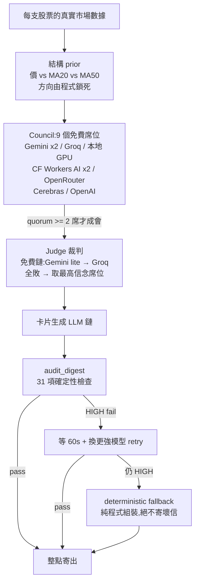

# LLM council + judge:一個天天在生產環境寄信的多模型仲裁系統(75 天實錄)

> MarketDaily 是一個每日財經 email 日報:訂閱者設定自己的持股,系統每天早晚兩班生成個人化 HTML 日報寄出。從 2026-05-19 第一個 commit 到今天跑了 75 天、1,800+ 個 commit。這篇講它的核心可靠層:**多模型 council + judge 仲裁 + 31 項使用者視角 audit**,以及三次真實事故怎麼把這套架構打磨出來的。

## 為什麼不是「一個模型 + fallback」

一開始的架構很普通:主模型掛了換備援模型。問題是財經內容的失敗模式不是「掛掉」,而是**安靜地變爛**——配額壓力下模型回一段看起來像日報的弱內容,沒有 exception,沒有 error code,用戶隔天早上直接收到爛信。

所以這套系統的設計哲學是三層分離:

1. **council(委員會)**:多個異質模型獨立表態,分歧本身是訊號
2. **judge(裁判)**:綜合共識與分歧,產出最終論點
3. **audit(稽核)**:確定性程式碼檢查最終 HTML,不信任任何 LLM 的自我報告



## Council:分歧是一等公民

每支股票一輪只跑一次(跨用戶共用快取)。每個席位拿到相同的真實數據 + 一個**結構硬約束**:方向由 `價 vs MA20 vs MA50` 的確定性規則鎖死,席位只能在「論點/反向風險/結構容許範圍內的傾向」這層發揮。席位若違反方向(多頭結構喊 short),程式直接把它降為 neutral——**LLM 永遠沒有翻方向的權力**。

```python
# 席位輸出被強制收斂(機制真實,程式碼改寫)
if lean not in ("long", "short", "neutral"):
    lean = "neutral"
if prior == "bull" and lean == "short":
    lean = "neutral"          # 死防線:席位不可翻方向

# 分歧度是輸出的一部分,不是要消除的噪音
uniq = set(o["lean"] for o in opinions)
dissent = 0 if len(uniq) == 1 else (2 if {"long", "short"} <= uniq else 1)
```

分歧度(0/1/2)會一路傳到最終卡片:標「分歧大」的股票,下游 prompt 被強制要求保守語氣,信心分數再往下壓。信心顯示另有歷史校準上限 75%,audit 抓到 >75% 就視為防線破口。

**席位選型的真實邏輯是配額隔離,不是模型評測分數。** council 於 06-30 上線(此前正是文章開頭批評的那種「單模型+fallback」),設定檔裡有 9 個免費席位、橫跨 7 家供應商——沒設 key 的席位自動跳過,常態約 5 把互相獨立的聲音。刻意全走免費層:Gemini 席位用 lite/2.0(把 2.5-flash 的配額留給用戶可見的卡片生成)、Groq 席位跟卡片主鏈用不同模型(同一支模型的 200,000 TPD 日額度會被 council 吃掉)、加一張本地 GPU(零配額零 429,全雲端斷線時唯一活口)。有一支模型(qwen3.6-27b)會把 prompt 給的 385.25 改寫成 385.00——捏造價位精度,所以它只准進 council(輸出是 JSON 觀點、不含價位),永遠不准碰生卡鏈。

## Judge:綜合,但有退路

裁判拿到全部席位意見的 JSON,任務是「綜合共識與分歧,不要只抄一家」。裁判鏈本身也有 fallback:Gemini lite → Groq → 兩者全敗就直接取**信念分數最高的席位**當結論。quorum 不足 2 席就不成會,該股走原單模型路徑。整條 council 是 fail-safe 的:任何失敗都回傳部分結果,**絕不擋寄信**——死線是「絕不缺信」,品質防線是「絕不寄壞信」,兩條線分開設計。

## Audit:寧可誤殺,不可放行

`digest_audit.py` 有 31 項獨立命名的檢查,每一項都對應一次「用戶曾經或將會生氣」的場景:時序紀律(早上 7 點不准寫「今天台股已漲」——9 點才開盤)、持股覆蓋(用戶選的每支股票都要有操作卡)、編造偵測(佔位符 XXX、假網址、無來源的預期 EPS)、prompt 指令洩漏(把「台股講…美股講…」這種給 LLM 的說明抄進成品)、輸出截斷、未定義 CSS class。

HIGH fail 的處理鏈:**等滿 60 秒**(免費層是 per-minute token 限制,5 秒後 retry 必然在同一個窗口再撞 429)→ 強制換更強模型重生 → 仍 fail 就切 deterministic fallback(純程式組裝、刻意不含價位)。

## 三次事故,三層新防線

**429 事故(06-11)**:Gemini 日配額耗盡,每次呼叫的 429 退避白燒約 100 秒,日報遲到 5 小時。修法:單模型連續兩次 429 = 判定配額死亡,整輪熔斷跳過。後來 council 席位也加了同款熔斷:配額耗盡/沒 key/連敗 3 次就本輪停用,402(帳單牆)首刀斃命。

**CSS class 事故(06-29 / 07-06)**:LLM 會把「沿用既有 CSS class」自由發揮成近似名(`news-title` vs `news-headline`),樣板沒這些規則,整個區塊裸奔。06-29 加了 `undefined_css_class` HIGH 檢查,結果 07-06 週一版(prompt 沒給逐字骨架)12/12 用戶全中,retry 同 prompt 同病,9 位被打成備援版——**防線自己變成了事故**。真正的修法是在檢查之前加一層確定性修復:已知近似名對映回正確 class,未知 class 直接拿掉(CSS 本來就沒規則,拿掉是視覺 no-op)。教訓:對 LLM 說「沿用既有 class」無效,逐字骨架才是規格;新增 HIGH 檢查前先想「如果全員都中會怎樣」。

**深度塌陷事故(07-23)**:免費配額全熔斷,卡片掉到弱模型,分析理由從 129–165 字塌到 48–64 字——**帶價位、格式全對,所以全部檢查放行**,是用戶(老闆本人)抓到的。修法:用 3 天正常日(median 107–197 字)和壞日(median 48 字)的真實資料校準出 `signal_reason_shallow` 檢查:median <80 字判定系統性塌陷。這條的教訓最值錢:audit 檢查格式容易,檢查「深度」必須先有正常日的統計基線。

另一條系統性熔斷同場加映:同一個 HIGH 檢查在一次生成中連中 3 位用戶,立刻推播管理員——per-user 的 retry→fallback 鏈遇到系統性 bug 會「安靜地全員降級」,必須有跨用戶的橫向視角。

## 值不值得?

日報 75 天、council 34 天、每天兩班、31 項檢查、9 個席位。這套東西的本質不是「多模型比單模型聰明」,而是:**方向由確定性程式鎖死、LLM 只在安全範圍內發揮、每一層輸出都被不信任地驗證、每次事故都變成一條新的確定性檢查**。LLM 在高風險場景的可靠性不是模型問題,是架構問題。

下一篇:31 項 audit 檢查的失效模式分類學——包含防線自己引發事故的完整解剖。
